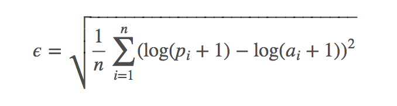
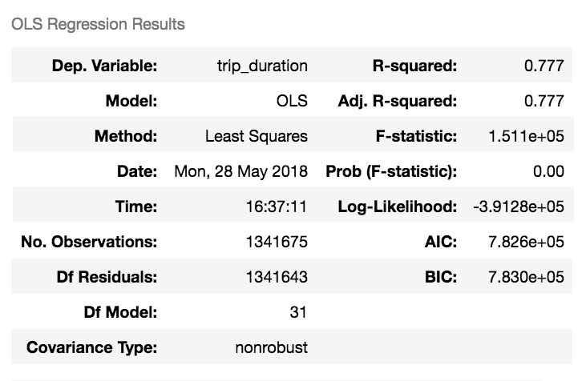
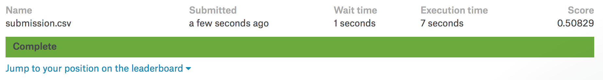

# Regression Project : New York City Taxi Trip Duration

[Kaggle Link](https://www.kaggle.com/c/nyc-taxi-trip-duration)

[Project Link](https://github.com/Romanism/Project/blob/master/01_New%20York%20City%20Taxi%20Trip%20Duration/PROJECT.ipynb)
  

## 1. Overview
#### 1.1 Team : Adaptor
- 강동수 [팀장]
- 김문수 [팀원]
- 지성인 [팀원]

#### 1.2 Project Period
- 시작일 : 2018/02/03
- 종료일 : 2018/03/14
- 발표일 : 2018/03/15

#### 1.3 Description

Kaggle is challenging you to build a model that predicts the total ride duration of taxi trips in New York City.

: 뉴욕시에서 택시 주행시간을 예측하는 것이 목적

#### 1.4 Evaluation (RMSLE)

- ϵ - RMSLE value (score)
- n - total number of observations in the (public/private) data set
- pi - prediction of trip duration
- ai - actual trip duration
- log(x) - natural logarithm

: 예측값과 실제값의 차이를 통한 점수 부여 (값이 낮을 수록 예측값이 실제값에 가까워 좋은 예측임을 의미)

#### 1.5 Data

##### 1.5.1 Data set
- train.csv - the training set (contains 1,458,644 trip records)
- test.csv - the testing set (contains 625,134 trip records)
- sample_submission.csv - a sample submission file in the correct format

##### 1.5.2 Data fields
- id - 운행 고유 id
- vendor_id - 택시 회사 id (0/1)
- pickup_datetime - 승차 시간
- dropoff_datetime - 하차 시간
- passenger_count - 승객 수
- pickup_longitude - 승차 위도
- pickup_latitude - 승차 경도
- dropoff_longitude - 하차 위도
- dropoff_latitude - 하차 경도
- store_and_fwd_flag - 주행 기록시 차량 메모리 저장 여부 (Y: 저장/전송, N: 미저장/전송)
- trip_duration - 주행시간 (초)
  

## 2. Project

#### 2.1 EDA
- Overall information
- Y data
- Y data & X data
- Y data & X data(two features)
- Correlation

#### 2.2 Feature select
- Check VIF
- Rough Modeling
- Optimal regulization

#### 2.3 Modeing
- Origin model
- Outlier 1회
- Outlier 2회

#### 2.4 Evaluation
- Summary report
- Probplot
- Chi-square
- Resid plot
- residual-feature 관계 검정

#### 2.5 submission
- Paticipate teams : 1,257
- Final Score : 0.49563
- Leaderboard : 782 / 1257 (62.2%)

  

## 3. Key point
- 종속변수의 log화 (정규분포화)
- Datetime 데이터를 분리해 새로운 데이터 생성
- 새로운 데이터 생성 (거리, 속도, 날씨)
- EDA를 통한 Outlier 제거
- Statesmodels를 통한 Linear Regression 모델 생성
- Cook's Distance를 통한 모델의 최적화
  

## 4. 느낀점

- Kaggle project를 처음해봐서 어떤 절차를 통해 평가가 되는지 파악하는데 시간이 많이 소요됨
- 파이썬으로 처음 진행했던 Regression project라 기본적으로 어떤 로직으로 진행해야 하는지 많이 헤맸음
- EDA의 부족함을 많이 느낌 (Y와 관련된 EDA를 통해 Feature선정이 필요하다는 것을 늦게 알게됨)
  

## 5. 개선점

- EDA를 더 체계적으로 진행할 필요가 있음
- 가지고 있는 Feature로는 성능이 한계가 있어 외부에서 활용할 수 있는 Feature를 가져오면 좋을것이라 생각됨
- Feature select 기준으로 VIF만을 통해 진행했었는데 더 좋은 방법이나 추가적인 기준이 필요할것으로 보임
- Outlier 제거 방법으로 Cook's distance을 사용했는데 추후 다른 방법들도 활용해볼 필요가 있음
