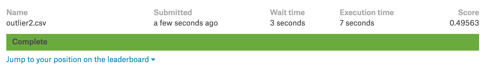

# DSS Team Project : New York City Taxi Trip Duration
[Project Link](https://www.kaggle.com/c/nyc-taxi-trip-duration)

---

### Team : Adaptor
- 강동수 [팀장]
- 김문수 [팀원]
- 지성인 [팀원]

### Project Period
- 시작일 : 2018/02/03
- 종료일 : 2018/03/14
- 발표일 : 2018/03/15

### Overview

#### 1. Description

In this competition, Kaggle is challenging you to build a model that predicts the total ride duration of taxi trips in New York City.

$\rightarrow$ 뉴욕시에서 택시 주행시간을 예측하는 것이 목적

#### 2. Evaluation (RMSLE)
$$\epsilon = \sqrt{\frac{1}{n} \sum_{i=1}^n (\log(p_i + 1) - \log(a_i+1))^2 }$$

$ϵ$ - RMSLE value (score)
$n$ - total number of observations in the (public/private) data set
$p_i$ - prediction of trip duration
$a_i$ - actual trip duration
$log(x)$ - natural logarithm

$\rightarrow$ 예측값과 실제값의 차이를 통한 점수 부여 (낮을 수록 예측값이 실제값에 가까워 좋은 예측임을 의미)

### Data

#### 1. Data set
- train.csv - the training set (contains 1,458,644 trip records)
- test.csv - the testing set (contains 625,134 trip records)
- sample_submission.csv - a sample submission file in the correct format

#### 2. Data fields
- id - 운행 고유 id
- vendor_id - 택시 회사 id (0/1)
- pickup_datetime - 승차 시간
- dropoff_datetime - 하차 시간
- passenger_count - 승객 수
- pickup_longitude - 승차 위도
- pickup_latitude - 승차 경도
- dropoff_longitude - 하차 위도
- dropoff_latitude - 하차 경도
- store_and_fwd_flag - 주행 기록시 차량 메모리 저장 여부 (Y: 저장/전송, N: 미저장/전송)
- trip_duration - 주행시간 (초)

### Modeling

#### 1. EDA
- 독립변수 ($X$)
  - 개별 EDA 실시
  - EDA를 통한 이상치 제거
  - 좌표 데이터를 통한 거리 생성
  - 시간 데이터를 월/일/시간/분 단위로 쪼갬
  - 변수간 상관관계 파악 (Heatmap)
  - 다중공선성 파악 (VIF)

- 종속변수 ($y$)
  - Normal 분포를 통한 정규성 확인
  - Boxplot을 통한 이상치 제거

#### 2. 데이터 검정
- 잔차정규성 검정
- Residual-Feature 관계 검정
- 이분산 검정
- 자기상관 검정

#### 3. 최적 정규화
- OLS를 통한 모델링 생성
- Feature 선정

#### 4. Modeling
- 1차 모델링
  - origin modeling
- 2차 모델링
  - 아웃라이어 1회 제거 (cook's distance)
- 3차 모델링
  - 아웃라이어 2회 제거 (cook's distance)

#### 5. submission
- Paticipate teams : 1,076
- Final Score : 0.50829
- Leaderboard : 808 / 1257 (64%)

