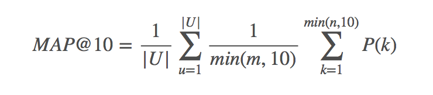
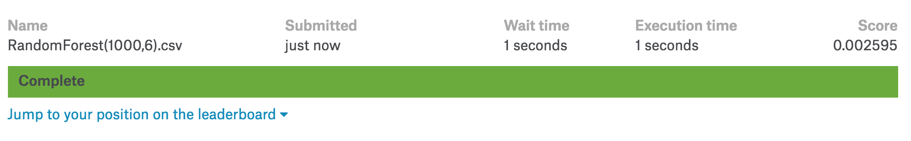

# Classification Project : Coupon Purchase Prediction

[Kaggle Link](https://www.kaggle.com/c/coupon-purchase-prediction#description)

[Project Link](https://github.com/Romanism/Project/blob/master/02_Coupon%20Purchase%20Prediction/PROJECT.ipynb)
  

## 1. Overview
#### 1.1 Team : Adaptor
- 지성인 [팀장]
- 이재웅 [팀원]
- 이준성 [팀원]

#### 1.2 Project Period
- 시작일 : 2018/03/23
- 종료일 : 2018/04/10
- 발표일 : 2018/04/11

#### 1.3 Description

Using past purchase and browsing behavior, this competition asks you to predict which coupons a customer will buy in a given period of time.

:  주어진 기간동안 고객들이 어떤 쿠폰을 구입할 지 예측하는 문제

#### 1.4 Evaluation (MAP@10)

- |U| - number of users
- P(k) - precision at cutoff k
- n - number of predicted coupons
- m - number of purchased coupons for the given user. If m = 0, the precision is defined to be 0

#### 1.5 Data set

- user_list.csv - the master list of users in the dataset
- coupon_list_train.csv - the master list of coupons which are considered part of the training set
- coupon_list_test.csv - the master list of coupons which are considered part of the test set. Your competition predictions should be sourced only from these 310 coupons. You will not receive credit for predicting training set coupons that were purchased during the test set period.
- coupon_visit_train.csv - the viewing log of users browsing coupons during the training set time period. You are not provided this table for the test set period.
- coupon_detail_train.csv - the purchase log of users buying coupons during the training set time period. You are not provided this table for the test set period.
- coupon_area_train.csv - the coupon listing area for the training set coupons
- coupon_area_test.csv - the coupon listing area for the test set coupons
- sample_submission.csv - a sample file showing the correct format for predictions
- documentation.zip - an archive of Excel files containing an entity relationship diagram and English translations
  

## 2. Project

#### 2.1 EDA
- Overall information
- Y data
- Y data & X data
- Y data & X data(two features)
- Correlation

#### 2.2 Feature select
- Check VIF
- Feature select

#### 2.3 Modeing
- Make data
- RandomForest
- XGBoost

#### 2.4 Submission

#### 2.5 submission
- Paticipate teams : 1,076
- Final Score : 0.002595
- Leaderboard : 794 / 1076 (73.7%)
  

## 3. 느낀점

- 파이썬으로 처음 진행했던 Classification project라 기본적으로 어떤 로직으로 진행해야 하는지 많이 헤맸음
- 단순히 분류가 아닌 구입할만한 쿠폰 10개 내외를 선정해야 하기 때문에 추천시스템의 느낌도 강했는데 이를 어떻게 적용할 수 있을지 고민이 많았음
- Kaggle에서 y_test에 대한 답이 나와있기 때문에 직접적으로 Confusion matrix, ROC curve등을 적용하기 어려웠음
  

## 4. 개선점

- Cosine유사도에 대한 공부가 필요하다고 판단 (추천시스템에서 많이 사용)
- 팀원간의 원할한 협업을 위해 변수명을 통일해서 프로젝트를 진행
