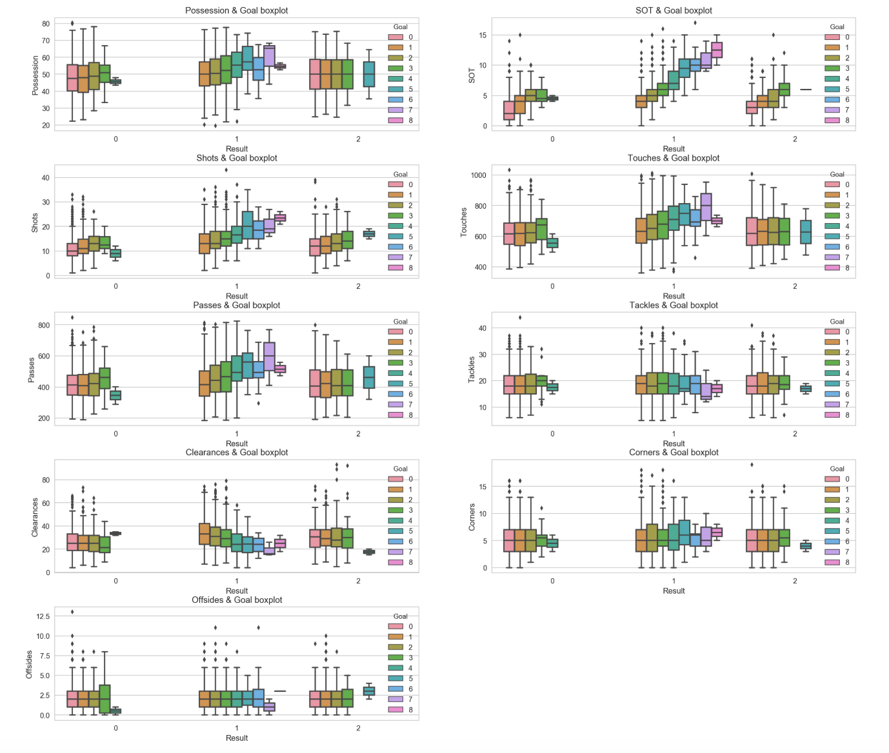
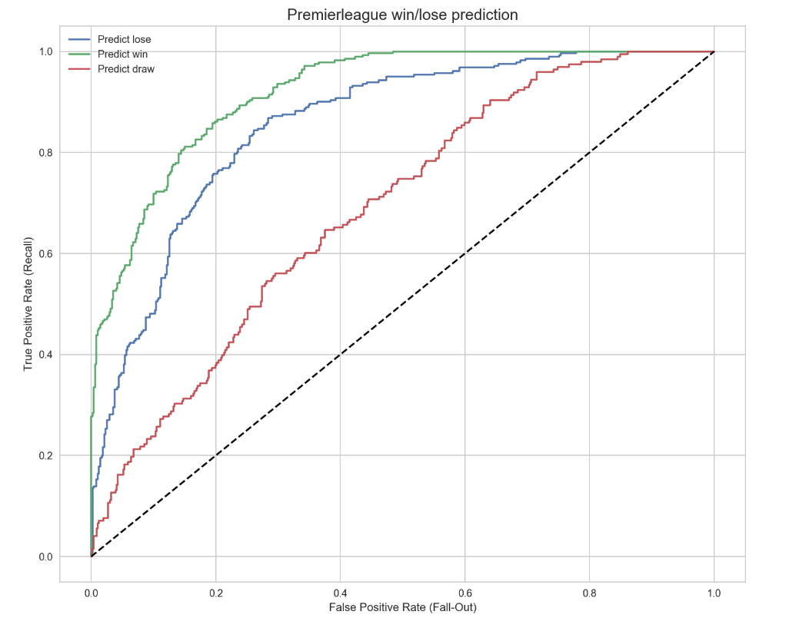

<h1>
The prediction models for the premierleague
</h1>

  

### 1. Introduction

#### 1.1 Objective
- 프리미어리그에서 승리를 하기 위해선 팀이 어느 정도의 Performance를 보여줘야 할까?
- 경기당 팀이 보여줬던 Performance를 분석해 앞으로 벌어지는 경기에 대해 예측하는 모델을 생성해보자!

#### 1.2 Data
- [프리미어리그 공식 홈페이지](https://www.premierleague.com)

#### 1.3 Tools
- Selenium
- Beautifulsoup
- Scikit-learn
- Matplotlib
- Seaborn
- Pandas
  

### 2. EDA (Exploratory data analysis)

- y값(Result)와 X값들의 분포 확인
- EDA를 통해 최종 Feature selection
  

### 3. Modeling
| Model|Precision|Recall|F1-score|Support|
|------|------|------|------|------|
|LDA|0.60|0.64|0.58|760|
|QDA|0.63|0.65| 0.60|760|
|Naive bayesian|0.54|0.55|0.54|760|
|Random Forest|0.62|0.65|0.57|760|
|Ada Boost|0.59|0.62|0.59|760|
|Gradient Boost|0.57|0.60|0.58|760|
|XG Boost|0.65|0.66|0.61|760|

- Best Model = XG Boost
  

### 4. Evaluation

- AUC Score : Predict Lose(0.86), Predict Win(0.92), Predict Draw(0.69)
