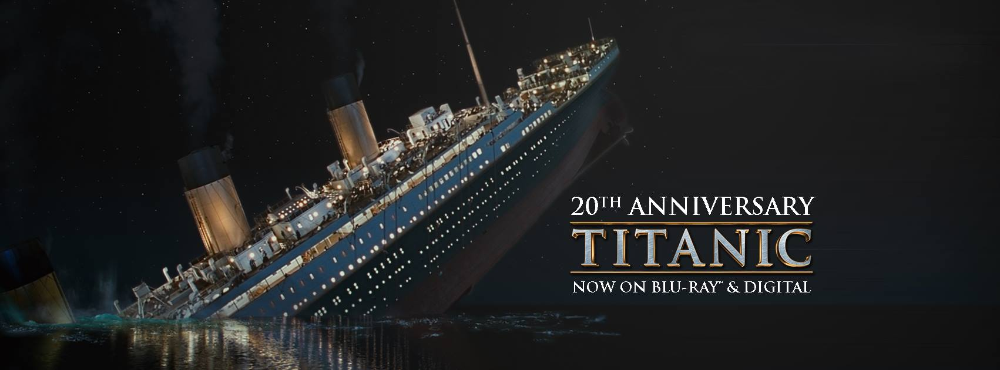

# Titanic: Machine Learning from Disaster

[Kaggle Link](https://www.kaggle.com/c/coupon-purchase-prediction#description)

[Project Link](https://github.com/Romanism/Project/blob/master/02_Coupon%20Purchase%20Prediction/PROJECT.ipynb)
  

## 1. Overview

#### 1.1 Project Period
- 시작일 : 2018/07/27
- 종료일 : 2018/07/28

#### 1.3 Description

In this challenge, we ask you to complete the analysis of what sorts of people were likely to survive. In particular, we ask you to apply the tools of machine learning to predict which passengers survived the tragedy.

: 데이터를 통해 승객의 생존여부를 판단하는 문제

#### 1.4 Evaluation (Accuracy)

Your score is the percentage of passengers you correctly predict. This is known simply as "accuracy”.

: accuracy(정확도)를 통해 평가

#### 1.5 Data

##### 1.5.1 Data set

- train.csv - should be used to build your machine learning models.
- test.csv - should be used to see how well your model performs on unseen data

##### 1.5.2 Data fields
- P-class : 승객의 등급 (1,2,3)
- survived : 생존 여부 (0,1)
- name : 이름
- sex : 성별
- fare : 승객이 지불한 가격
- cabin : 캐비닛 번호
- embarked : 승선 지역
- age : 나이
- sibsp : 동승한 형제자매나 배우자의 수
- parch : 동승한 직계가족의 수(자식, 부모)
- ticket : 티켓 번호
  

## 2. Project

#### 2.1 EDA
- Overall information
- Y data
- Y data & X data
- Correlation

#### 2.2 Feature select
- Check VIF
- Preprocessing

#### 2.3 Modeing
- Xgboost
- GridSearch
- Cross Validation

#### 2.4 Evaluation
- Confusion Matrix
- Submision

#### 2.5 submission
- Paticipate teams : 1,257
- Final Score : 0.77033
- Leaderboard : 6,040 / 9,573 (63.1%)

  

## 3. Key point
- Kaggle 입문용 Project
- 전반적인 Machine Learning Project를 경험함
  

## 4. 느낀점

- 전반적인 분류 프로젝트를 경험할 수 있었음
- 나름대로 흥미로운 주제였음
  

## 5. 개선점

- 버린 변수들을 활용할 방법을 찾는게 중요할 것으로 판단
- 전처리를 다양한 방법으로 할 필요성을 느낌
